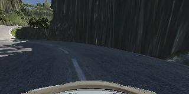

# Behaviorial Cloning Project

[](http://www.udacity.com/drive)

### This project consists of the following steps:

*  Data Collection by running the simulator.
*  Data Exploration For better understanding.
*  Building models that can predict steering angles.
*  Testing the model and recording the video.
*  Discussion about the shortcomings of this approach.

**File Specification :**

These project repository consists of 6 main files .

           1.  model.py : Python file for running the training operation either from start or load a
                          pretrained model to carry out further training.
                           
           2.  behavorial_cloning.ipynb : A ipython notebook has been included to better understand the
                                          model parameters,data exploration and training time , loading
                                          a pretrained model etc.(It is not required by udacity.)
           
           3.  drive.py : Python file for feeding the simulator with prediction data .
           
           4.  video.py : Python file for making video from recorded image through testing the model.
           5.  model.h5 : The trained model was saved in hdf file format by keras . This file is
                          required for sucessfully running the simulator in autonomous mode.
                          
           6.  video_track1.mp4 : The video made by video.py using the data captured by the drive.py 
                                  during the driving in autonomous mode for track one.
                                  
**Hardware an environment specification :**
 
 * OS used : Ubuntu Linux 16.04 LTS
 * This project is done in python version 3.6.1 .
 * Tensorflow version 1.2.1 is used. (Build with CUDA 8 and CUDNN 6 support and compiled from source)
 * keras version 2.0.6 is used. (keras version 1.x.x will not work)
 * GEFORCE GTX 1050 gpu with memory 4 GB is used for training . (Cuda compute capability of 6.1)

**Usage**

* Suppose the data directory named 'data' is in working directory and contains the 'IMG' directory 
  and 'driving_log.csv' file then to train it with alexnet architecture,try it in a terminal.
  
         python model.py --model_arch='alexnet' --datadir='data' --batch_size=32

* After successfull training, let the model has been saved in working directory named 'model.h5' and 
  to drive the car in autonomous mode and caputure the run in a 'run1' directory,try it in a terminal
         
         python drive.py model.h5 run1

* For making video from the directory 'run1',try it in a terminal
         
         python video.py run1 --fps=48
 
 **Data Collection :**
  
  * The obvious approach for training deep neural network to work better is to train it on more data.
  * Around 153k images have been used for training .
  * Images are from both two tracks with 70:30(track1:track2) proportion.
  * All center,left,right images are used .
  * And images were flipped for data augmentation .```flipped()``` function is used for this purpose.
  * Some of my collected data for training :
  
  Image taken from center camera on track 2.
  
  
  
  Image taken from left camera on track 1.
  
  
  
  Image taken from right camera on track 1.
  
  
  
  ## Model Specification :
  Here I mainly tried 2 different models for training.
  
  [**NVIDIA MODEL ARCHITECTURE :**](https://devblogs.nvidia.com/parallelforall/deep-learning-self-driving-cars/)
  
  First is NVIDIA convnet architecture which was used by Nvidia to train and test on real autonomous car .
  
  
            ----------------------------------------
            |     Output Layer (No activation)     |
            ----------------------------------------
                            /\
                            ||
            ----------------------------------------
            |               FC layer               |
            |   num_outputs=10  , activation='elu' |
            ----------------------------------------
                            /\
                            ||
            ----------------------------------------
            |                FC layer              |
            |   num_outputs=50  , activation='elu' |
            ----------------------------------------
                            /\
                            ||
            ----------------------------------------
            |                FC layer              |
            |  num_outputs=100  , activation='elu' |
            ----------------------------------------
                            /\
                            ||
            ----------------------------------------
            |            Flatten layer             |
            ----------------------------------------
                            /\
                            ||
            ----------------------------------------
            |            Conv layer                |
            |  3x3 64 filters with stride (1,1)    |
            |  valid padding , activation ='elu'   |
            ----------------------------------------
                            /\
                            ||
            ----------------------------------------
            |            Conv layer                |
            |  3x3 64 filters with stride (1,1)    |
            |  valid padding , activation ='elu'   |
            ----------------------------------------
                            /\
                            ||
            ----------------------------------------
            |            Conv layer                |
            |  5x5 48 filters with stride (2.2)    |
            |  valid padding , activation ='elu'   |
            ----------------------------------------
                            /\
                            ||
            ----------------------------------------
            |            Conv layer                |
            |  5x5 36 filters with stride (2,2)    |
            |  valid padding , activation ='elu'   |
            ----------------------------------------
                            /\
                            ||
            ----------------------------------------
            |            Conv layer                |
            |  5x5 24 filters with stride (2,2)    |
            |  valid padding , activation ='elu'   |
            ----------------------------------------
                            /\
                            ||
            ----------------------------------------
            |       Preprocessing layer            |
            |          Normalization               |
            ----------------------------------------
                            /\
                            ||
            ----------------------------------------
            |       Preprocessing layer            |
            |    Resizing image to 66x200          |
            ----------------------------------------
                            /\
                            ||
            ----------------------------------------
            |       Preprocessing layer            |
            |    Cropping image to size 50x320     |
            ----------------------------------------
                           /\
                           ||
                   INPUT(Size = 160x320)


ImageSource: Nvidia website

-------

[**ALEXNET ARCHITECTURE :**](https://papers.nips.cc/paper/4824-imagenet-classification-with-deep-convolutional-neural-networks.pdf)

   I removed top 3 fully connected layers as were in original architecture and added three fc layers
   of size 100,50,10 respectively . Hence it is a regression problem so there is no softmax layer at output.
   Here I used 'elu'(exponential linear unit) as activation instead of relu .
   
  

            ----------------------------------------
            |     Output Layer (No activation)     |
            ----------------------------------------
                            /\
                            ||
            ----------------------------------------
            |               FC layer               |
            |   num_outputs=10  , activation='elu' |
            ----------------------------------------
                            /\
                            ||
            ----------------------------------------
            |                FC layer              |
            |   num_outputs=50  , activation='elu' |
            ----------------------------------------
                            /\
                            ||
            ----------------------------------------
            |                FC layer              |
            |  num_outputs=100  , activation='elu' |
            ----------------------------------------
                            /\
                            ||
            ----------------------------------------
            |            Flatten layer             |
            ----------------------------------------
                            /\
                            ||
            ----------------------------------------
            |             MaxPooling               |
            |   kernel = (3,3),stride = (2,2)      |
            ----------------------------------------
                            /\
                            ||
            ----------------------------------------
            |            Conv layer                |
            |  3x3 256 filters with stride (1,1)   |
            |  same padding , activation ='elu'    |
            ----------------------------------------
                            /\
                            ||
            ----------------------------------------
            |            Conv layer                |
            |  3x3 384 filters with stride (1,1)   |
            |  same padding , activation ='elu'    |
            ----------------------------------------
                            /\
                            ||
            ----------------------------------------
            |            Conv layer                |
            |  3x3 384 filters with stride (1,1)   |
            |  same padding , activation ='elu'    |
            ----------------------------------------
                            /\
                            ||
             ----------------------------------------
            |             MaxPooling               |
            |   kernel = (3,3),stride = (2,2)      |
            ----------------------------------------
                             /\
                             ||
            ----------------------------------------
            |    Batch Normalization Layer         |
            ----------------------------------------
                             /\
                             ||
            ----------------------------------------
            |            Conv layer                |
            |  5x5 256 filters with stride (1,1)   |
            |  same padding , activation ='elu'    |
            ----------------------------------------
                             /\
                             ||
            ----------------------------------------
            |             MaxPooling               |
            |   kernel = (3,3),stride = (2,2)      |
            ----------------------------------------
                             /\
                             ||
            ----------------------------------------
            |    Batch Normalization Layer         |
            ----------------------------------------
                             /\
                             ||
            ----------------------------------------
            |            Conv layer                |
            |  11x11 96 filters with stride (4,4)  |
            |  same padding , activation ='elu'    |
            ----------------------------------------
                             /\
                             ||
            ----------------------------------------
            |       Preprocessing layer            |
            |          Normalization               |
            ----------------------------------------
                             /\
                             ||
            ----------------------------------------
            |        Preprocessing layer           |
            |    Resizing image to 224x224         |
            ----------------------------------------
                             /\
                             ||
            ----------------------------------------
            |       Preprocessing layer            |
            |    Cropping image to size 50x320     |
            ----------------------------------------
                             /\
                             ||

                    INPUT (Size = 160x320)
                    

ImageSource:Udacity

### Discussions:

* ```path_remover()``` : This function is introduced because the simulator writes the whole directory path to the 
  image names in case of moving the directory to other locations it may raise ```FileNotFoundError```.
* ```flipped()```: This function flipped the image input through vertical axis.
* For images taken from left camera a correction factor of 0.27 and for right camera  -0.27 is added to the measure of 
  steering angle taken from center camera.
* Track one contains most of left turns so when there is a right turn it will not work well so flipping the images is 
  very powerful technique. 
* Here I insert ```flipped_ ``` phrase to every image names so that the generator function can understand when to 
  flip the image . When image file name starts with ```flipped_``` then simply the generator function read the same 
  image with ```flipped_``` omitted  and then flipped it through flipped() and the corresponding steering angles also 
  being   multiplied by -1.
* The generator() is used here mainly for the memory limitation of our local or remote machines . It will generate the 
  train data of specified batch size .
* Two kinds of model architecture being discussed above ,I have trained it by both models but alexnet architecture 
  works better for me . **The model.h5 file is the trained model using alexnet structure.**
* I have tried both 'relu' and 'elu' activation function but 'elu' gives better convergence properties in 
  these case than 'relu'. ELU stands for exponential linear unit .
  
      elu:
          f(x,a) = a(exp(x)-1) for x < 0
                 = x for x>0 or x=0
 * A discussion on ELU networks can be found on http://image-net.org/challenges/posters/JKU_EN_RGB_Schwarz_poster.pdf 
 
 * The model is trained for 10 epochs with batch size 128 and train_test_split() function from sklearn is used for
   splitting data into training and validation set.
 * Two call back functions added. One is ModelCheckpoint() which saves the model in every epochs. Other is TensorBoard()
   for tensorboard graph visualization.
 * For visualizing the graph go to the terminaland type:
  
          tensorboard --logdir=logdir
 * Also an matplotlib visualizing function is added to see the graph of training loss and validaton loss. 
 
### Shortcomings of this approach:
* This approach is not suitable for running the model on the second track . The model learned to take turns but is incapable
  of drive through up-hills.
* For running it successfully on second track it I think the cropping step should be ommitted. Because when driving in plane 
  ommiting most of the parts except the road is okay but for hill roads the front view is necessary for understanding 
  the slopes.
  
### Some more models:
* In the jupyter notebook I have added two more models for comparison of parameters.
* In the nvidia architecture the total number of trainable parameters are : 252,219
* In the nvidia architecture the total number of trainable parameters are : 4,675,175
* In the nvidia architecture the total number of trainable parameters are : 19,906,919
* In the nvidia architecture the total number of trainable parameters are : 2,587,861,095
* From the above we can see ZFNET (modified version of alexnet) and VGG-19 model architecture is more computationally
  expensive. These architectures may be used for training when more GPU memory is available.
